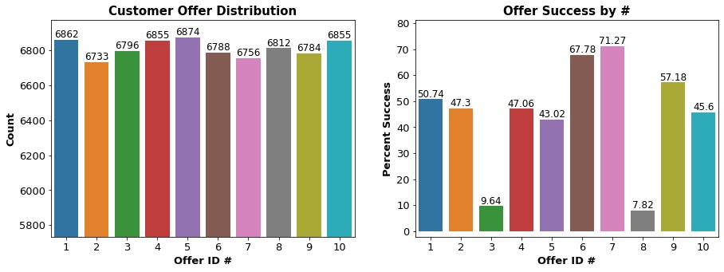
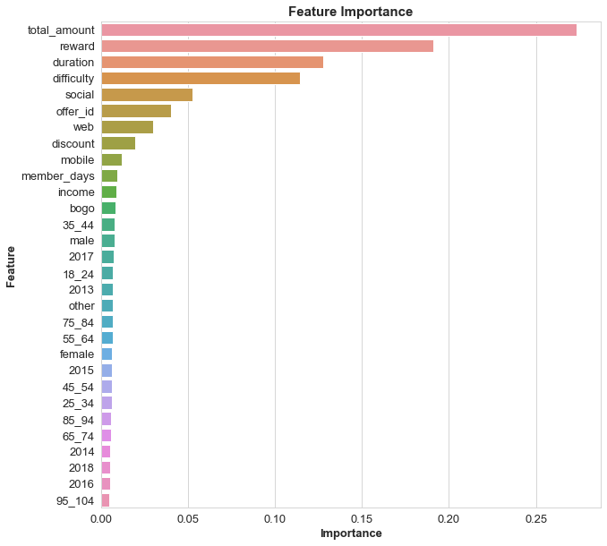

# Starbucks Capstone Project

### by Darren Gidado
 

 
## Table of Contents

 1. [Project Motivation](#projectmotivation)
 2. [Summary](#summary)
 3. [Dependencies](#dependencies)
 4. [Installation](#installation)
 5. [Instructions](#instructions)
 
## Project Motivation

This project contains simulated data that mimics customer behavior on the Starbucks rewards mobile app. Once every few days, Starbucks sends out an offer to users of the mobile app. An offer can be merely an advertisement for a drink or an actual offer such as a discount or BOGO (buy one get one free). Some users might not receive any offer during certain weeks.

Not all users receive the same offer, and that is the challenge to solve with this data set.

Our task is to combine transaction, demographic and offer data to determine which demographic groups respond best to which offer type. This data set is a simplified version of the real Starbucks app because the underlying simulator only has one product whereas Starbucks actually sells dozens of products.

Every offer has a validity period before the offer expires. As an example, a BOGO offer might be valid for only 5 days. We'll see in the data set that informational offers have a validity period even though these ads are merely providing information about a product; for example, if an informational offer has 7 days of validity, we can assume the customer is feeling the influence of the offer for 7 days after receiving the advertisement.

We'll use transactional data showing user purchases made on the app including the timestamp of purchase and the amount of money spent on a purchase. This transactional data also has a record for each offer that a user receives as well as a record for when a user actually views the offer. There are also records for when a user completes an offer.

Keep in mind as well that someone using the app might make a purchase through the app without having received an offer or seen an offer.

## Conclusion

We wanted to find out if a customer would respond to an offer by building a model that predicts just that.

**Step 1:** The first step was to evaluate the data we had to work with. We had three json files to work with, portfolio.json - includes offer meta data, profile.json - includes demographic data for each customer, and transcript - includes records for trasactions, offers viewed/received/completed.


**Step 2:** The second step was to convert each dataset to DataFrames before exploring and cleaning them in preparation to combining them. I saved the cleaned DataFrame as a csv file before splitting into training and testing sets. Next, I scaled the X_train and X_test arrays to minimise bias to prepare for fitting them into a suitable algorithm.



**Step 3:** I used a special function to loop over various selected algorithms to see how each compares with the model I fit. From the results RF and XGBoost scored very well so I continued fine tuning XGBoost using RandomSearchCV to find the best parameters to use on our model. I saved the model files and continued to further evaluate training quality by looking at the Logloss and Classification Errors. I also looked at the Confusion Matrix and Feature Importance of the model to make sure it can accuratly classify each prediction. My analysis returned training data scores of:

- Training Accuracy: 92.42%
- Training F1 Score: 91.70%


**Step 4:** Look at other ways to evaluate the model and determine if it is overfitting or underfitting.

**Step 5:** Feature Importance as discussed earlier refers to a numerical value used to describe the predictive power of each feature in the dataset. This is used to determine which features will provide the best fit for the model so accurate predictions can be made. This is importance, since variable selection is quite difficult. The top 5 importances are:



1. **total_amount** - amount spent by the customer
2. **reward** - reward given for completing an offer
3. **offer_duration** - time for offer to be open
4. **offer_difficulty** - minimum required spend to complete an offer
5. **social** - the offer was received on a social channel

## Dependencies

- Python: 3.5+
- Machine Learning Libraries: Pandas, NumPy, SciPy, Sciki-Learn, XGBoost
- Data Visualization: Matplotlib, Seaborn
- Model Loading and Saving Library: Joblib
- Progress bar - Tqdm

## Installation

To clone the git repository:
```
git clone https://github.com/ags911/udacity-dsnd.git
```

## Instructions

1. Install the necessary packages from dependencies.
2. Run the ipynb notebook.
